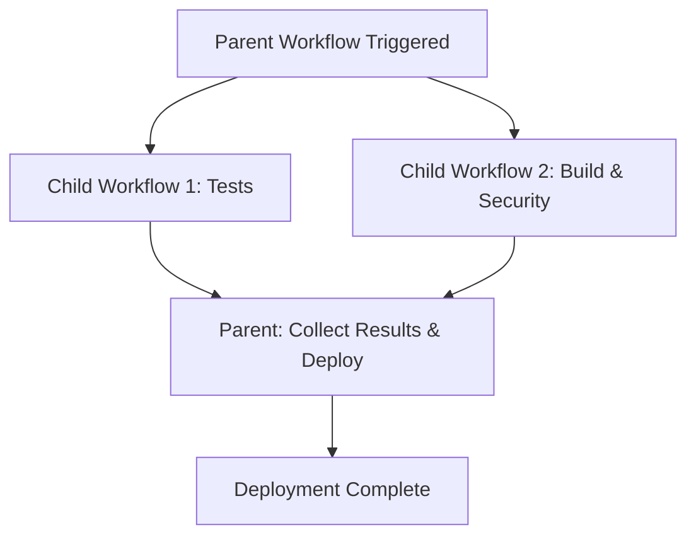

# Workflow Order Example Project

This project demonstrates a GitHub Actions workflow structure with two child workflows and one parent workflow, where the parent workflow executes after both child workflows complete.

## Project Structure

```
.github/workflows/
├── child-workflow-1.yml    # Child Workflow 1 - Tests
├── child-workflow-2.yml    # Child Workflow 2 - Build & Security
└── parent-workflow.yml     # Parent Workflow - Comprehensive CI/CD
```

## Workflow Architecture

### Child Workflows

#### 1. Child Workflow 1 - Tests (`child-workflow-1.yml`)
- **Purpose**: Runs unit tests and generates test reports
- **Jobs**:
  - `run-tests`: Sets up Node.js, installs dependencies, runs tests
- **Artifacts**: Uploads test results to `test-results-child1`
- **Triggers**: Can be called by other workflows or triggered on push/PR

#### 2. Child Workflow 2 - Build & Security (`child-workflow-2.yml`)
- **Purpose**: Builds the application and performs security scans
- **Jobs**:
  - `build`: Builds the application and creates build artifacts
  - `security-scan`: Runs security vulnerability scanning
- **Artifacts**: 
  - Uploads build artifacts to `build-artifacts-child2`
  - Uploads security results to `security-results-child2`
- **Triggers**: Can be called by other workflows or triggered on push/PR

### Parent Workflow

#### Parent Workflow - Comprehensive CI/CD (`parent-workflow.yml`)
- **Purpose**: Orchestrates the entire CI/CD pipeline
- **Execution Order**:
  1. **Parallel Execution**: Runs both child workflows simultaneously
     - `run-tests` (calls child-workflow-1.yml)
     - `run-build-security` (calls child-workflow-2.yml)
  2. **Sequential Execution**: After both children complete
     - `collect-and-deploy`: Collects results and performs deployment

## Workflow Execution Flow



## Key Features

### 1. **Parallel Child Execution**
- Both child workflows run simultaneously for efficiency
- Each child workflow is independent and can be reused

### 2. **Dependency Management**
- Parent workflow waits for both children using `needs: [run-tests, run-build-security]`
- Uses `if: always()` to run collection job even if children fail

### 3. **Artifact Aggregation**
- Parent workflow downloads all artifacts from child workflows
- Combines and processes results from multiple sources
- Creates a final deployment package

### 4. **Error Handling**
- Checks the result status of each child workflow
- Fails the parent workflow if any required child fails
- Provides clear status reporting

## Usage

### Triggering the Workflows

The parent workflow (`parent-workflow.yml`) is the main entry point and will automatically trigger both child workflows when:
- Code is pushed to `main` or `develop` branches
- A pull request is opened against `main` or `develop` branches

### Individual Child Workflow Testing

Each child workflow can also be triggered independently for testing:
- Push changes to trigger individual workflows
- Manually trigger workflows from the GitHub Actions tab

## Customization

### Adding More Child Workflows
1. Create a new workflow file in `.github/workflows/`
2. Add `workflow_call` trigger for reusability
3. Update the parent workflow to include the new child in the `needs` array

### Modifying Execution Order
- To run children sequentially: Add `needs` dependencies between child workflows
- To add more parent jobs: Create additional jobs with appropriate `needs` dependencies

## Benefits of This Architecture

1. **Modularity**: Each workflow has a specific purpose and can be maintained independently
2. **Reusability**: Child workflows can be called by multiple parent workflows
3. **Parallel Execution**: Improves overall pipeline performance
4. **Clear Dependencies**: Easy to understand execution order and dependencies
5. **Artifact Management**: Centralized collection and processing of build artifacts
6. **Error Handling**: Robust error checking and reporting

## Example Scenarios

This pattern is useful for:
- **Complex CI/CD Pipelines**: Where different teams manage different parts
- **Multi-Environment Deployments**: Running tests in parallel before deployment
- **Compliance Requirements**: Separate security and quality checks
- **Large Monorepos**: Different workflows for different components